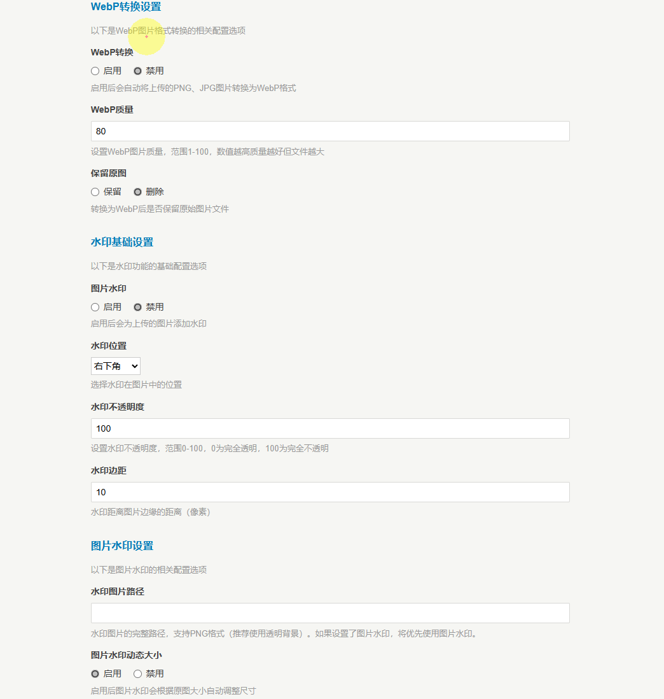
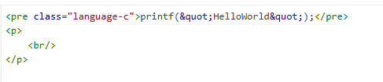

# UEditorPlus for Typecho

基于 [https://github.com/LinkPoly/UEditor-for-Typecho](https://github.com/LinkPoly/UEditor-for-Typecho) 和 [https://github.com/modstart-lib/ueditor-plus](https://github.com/modstart-lib/ueditor-plus) 二次开发的 Typecho 编辑器插件。

> **项目背景**
>
> UEditor-for-Typecho 是一款非常优秀的插件，但遗憾的是已有几年未更新。本项目在此基础上进行了大量重构与优化，移除了过时的云存储代码（又拍云/腾讯云），引入了最新的 UEditor Plus 内核，并由 **XiNian-dada** 深度定制了图片处理与代码编辑体验。

## 🌟 功能亮点 (v4.1.0)

本项目不仅同步了 UEditor Plus v4.1.0 的最新特性，还针对 Typecho 写作场景进行了深度增强：

### 核心体验增强
* **🆕 代码块智能补全**：新增代码块内括号、引号自动补全功能，写代码更顺手。
* **🆕 逻辑优化**：优化了代码块的插入逻辑，通过 `auto-complete.js` 实现更流畅的交互。
* **🆕 可视化 LaTeX**：优化了可视化 LaTeX 公式的添加与编辑体验，数学公式输入更直观。
* **文档一键导入**：支持 Word 文档（docx）、Markdown 文档（md）直接导入编辑器。
* **全新 UI 设计**：使用字体图标全面替换原有图片图标，界面更加现代、简洁。

### 强大的图片处理 (新增)
插件内置了强大的图片预处理功能，无需依赖第三方服务：
* **🖼️ 自动 WebP 转换**：支持上传图片自动转换为 WebP 格式，并可设置压缩质量，大幅减少图片体积。
* **💧 智能水印系统**：
    * **双模式支持**：支持图片水印和文字水印。
    * **动态大小**：水印字号/图片根据原图尺寸**动态调整**，告别水印比例失调的问题。
    * **智能阈值**：可设置“最小处理宽高”，避免给过小的图片添加水印。

## 📸 功能预览

### 💧 智能水印与图片处理
支持对上传图片自动添加水印，并提供高度定制化的动态调整方案：

### 🧮 可视化 LaTeX 公式
优化后的数学公式添加功能，支持所见即所得的可视化编辑：

### 💻 全新代码块编辑
全新的代码块管理逻辑，支持括号、引号自动补全，提升开发笔记记录效率：

## ⚙️ 插件配置详解

启用插件后，你可以在设置面板中进行详细配置：

### 1. WebP 转换设置
* **开关**：一键开启/关闭自动转换。
* **质量控制**：自定义 WebP 质量（1-100）。
* **原图保留**：可选择转换后是否保留原图。

### 2. 水印设置
* **基础设置**：调整水印位置（九宫格）、透明度及边距。
* **图片水印**：支持上传 PNG 透明水印，支持设置最大宽高占比（%）。
* **文字水印**：支持自定义颜色、边框、以及根据图片尺寸动态计算的字体大小。支持通过放入 `font.ttf` 自定义字体。

### 3. 处理阈值
* **最小尺寸限制**：设置最小宽度和高度，小于该尺寸的图片将自动跳过处理。

## 📥 安装使用

1. 下载本项目源码。
2. 将文件夹重命名为 `UEditorPlus`。
3. 上传至网站的 `/usr/plugins/` 目录下。
4. 登录 Typecho 后台，在“控制台” -> “插件”中启用本插件。

## 👥 作者与致谢

* **Plugin Original Author**: [jubaoshou](https://github.com/jubaoshou)
* **Current Maintainer & Contributor**: [XiNian-dada](https://github.com/XiNian-dada)
* **Upstream Project**: [UEditor Plus](https://github.com/modstart-lib/ueditor-plus) (ModStart)
* **Original Project**: [UEditor-for-Typecho](https://github.com/LinkPoly/UEditor-for-Typecho)

---
*本项目遵循开源协议，欢迎提交 Issue 和 PR 共同完善。*